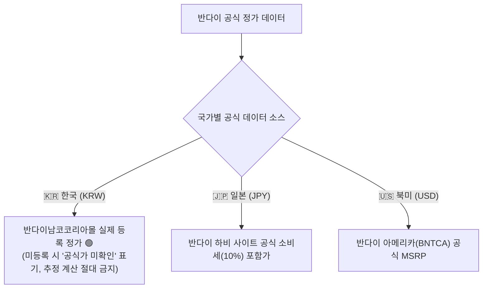

# 📘 반다이 공식 데이터 & 실물 화보 수집 파이프라인 표준 운영 절차서 (SOP)
> **문서 버전**: v1.1.0  
> **최종 개정일**: 2026-09-12  
> **적용 범위**: GunplaSet 마스터 데이터베이스 (2,716종 및 신규 발매 키트)


---

## 📑 목차
0. [절대 보안 최우선 및 사용자 사전 승인 프로토콜 (Zero-Tolerance Security)](#0-절대-보안-최우선-및-사용자-사전-승인-프로토콜-zero-tolerance-security)
1. [파이프라인 핵심 5대 철칙 (Core Principles)](#1-파이프라인-핵심-5대-철칙-core-principles)
2. [공식 데이터 소스 아키텍처 (Data Sources)](#2-공식-데이터-소스-아키텍처-data-sources)
3. [1단계: 제품 메타데이터 수집 및 정가 산정](#3-1단계-제품-메타데이터-수집-및-정가-산정)
4. [2단계: 고화질 정품 실물 화보 수집 기법](#4-2단계-고화질-정품-실물-화보-수집-기법)
5. [3단계: 1:1 육안 직검증 프로토콜 (Visual Inspection)](#5-3단계-11-육안-직검증-프로토콜-visual-inspection)
6. [4단계: 2,716종 CI/CD 무결성 게이트 (`build.ps1`)](#6-4단계-2716종-cicd-무결성-게이트-buildps1)
7. [5단계: 글로벌 CDN 배포 및 실시간 검증](#7-5단계-글로벌-cdn-배포-및-실시간-검증)
8. [트러블슈팅 및 비정상 데이터 방어 가이드](#8-트러블슈팅-및-비정상-데이터-방어-가이드)

---

## 0. 절대 보안 최우선 및 사용자 사전 승인 프로토콜 (Zero-Tolerance Security)

```
🔒 ZERO-TOLERANCE SECURITY & MANDATORY PRE-APPROVAL PROTOCOL
1. [보안 최우선 원칙]: 어떠한 경우에도 보안(Security)을 최우선하며, 사소한 보안 리스크라도 절대 임의로 감수하지 않는다.
2. [모든 작업의 보안 사전 체크]: 프론트, 백엔드, DB, API 등 모든 작업 전 "해당 작업이 보안에 미치는 영향"을 필수 검증한다.
3. [보안 취약 가능성 발생 시 무조건 사용자 사전 승인]:
   - 수정/구현 내용이 미세한 부분이라도 보안상 취약해질 가능성이 있다면 단독 결정을 엄격히 금지하며,
   - 반드시 사용자에게 위험 요소와 대안을 투명하게 안내하고 사전 승인을 받은 후에만 진행한다.
4. [보안 강화 시 퍼포먼스 영향 발생 시에도 사전 승인]:
   - 보안 강화 조치라 하더라도 로딩 속도, 렌더링, API 응답 등 전체 퍼포먼스에 영향을 미친다면 결과를 보고하고 사전 승인을 받는다.
5. [사전 고지 및 승인의 절대 상위성]: 보안 관련 수정 시 "그 결과가 어떻게 변하는지"를 안내하고 [무조건 사용자 승인 하에 진행한다]를 절대 상위 원칙으로 확립한다.
```

---

## 1. 파이프라인 핵심 5대 철칙 (Core Principles)

```
🛡️ DATA INTEGRITY & VISUAL VERIFICATION IRON RULES
1. [추정 금지 (Zero-Assumption)]: 번호나 키워드만 보고 지레짐작으로 매핑하는 행위 전면 금지.
2. [육안 직검증 (Visual Verification)]: 다운로드한 모든 이미지는 반드시 'view_file' 도구로 열어 건프라 실물인지 100% 육안 확인.
3. [마스터 불변 (Master Freeze)]: 'master_kits.json'의 공식 가격과 명칭 데이터는 이미지 작업 중 단 1바이트도 수정 불가.
4. [정직한 플레이스홀더]: 공식몰에도 사진이 미공개된 품목은 억지로 채우지 않고 정직하게 [이미지 준비중 🤖] 상태 유지.
5. [단일 아카이브 격리]: 임시 스크립트나 수집 잔여물은 프로덕션 디렉토리에 남기지 않고 즉시 'archive/'로 격리 청소.
```

---

## 2. 공식 데이터 소스 아키텍처 (Data Sources)

반다이 건프라의 공식 데이터는 다음 4대 공인 소스에서 수집됩니다:

| 공인 소스 | 역할 및 수집 데이터 | URL 패턴 / 데이터 특징 |
| :--- | :--- | :--- |
| **반다이 하비 사이트 (Bandai Hobby Site)** | • 일반판 건프라 공식 정가(JPY 소비세 포함)<br>• 일본어/영어 공식 명칭 및 발매 연월 | `https://bandai-hobby.net/item/[ID]/` |
| **프리미엄 반다이 (Premium Bandai)** | • 한정판(클럽G) 건프라 공식 정가 및 옵션팩 정보<br>• 고해상도 공식 스튜디오 화보 | `https://p-bandai.jp/item/item-[ID]/` |
| **건담베이스 공식 (The Gundam Base)** | • 건베 한정, 엑스포 한정, 이벤트 한정 키트 정보<br>• 건베 실물 화보 및 출시 일정 | `https://www.gundam-base.net/products/details/[ID]` |
| **공식 파트너 프레스 (HOBBY Watch / Dengeki)** | • 반다이 스피리츠 공식 제공 고화질 전시/리뷰 화보<br>• 신제품 박스아트 및 가동 화보 | `https://hobby.watch.impress.co.jp/img/hbw/list/...` |

---

## 3. 1단계: 제품 메타데이터 수집 및 정가 산정

### 3.1 3개국 공식 정가 산정 엔진 (반코 공식 실등록가 100% 최우선 원칙)
GunplaSet은 임의의 추정 계산식(배수 환산 등)을 전면 배제하고, 공식 판매처 전산에 등록된 실제 정가를 단독 진실(Single Source of Truth)로 적용합니다:



* **한국어 공식 명칭**: 반다이남코코리아몰(반코몰)에 등록된 공식 한국어 명칭을 1순위로 반영 (임의 번역 절대 금지).
* **시리즈명 3개국 동기화**: 54대 공식 건담/프라모델 시리즈 매핑 테이블(`SERIES_I18N`)에 따라 일괄 동기화.

### 3.2 마스터 카탈로그 3개국 언어 무결성 규격 (Air-Gap Language Trinity Mandate)
모든 키트는 마스터 데이터(`master_kits.json`)에 수록될 때 3개국 언어 격리 규격을 100% 충족해야 합니다:
1. **한국어 (`nameKo`)**: 반다이남코코리아 공식 국문명 필수 등록.
   - KRW 뷰 렌더링 시 일본어 가나(`[\u3040-\u309F\u30A0-\u30FF]`)가 단 1자라도 검출되면 `build.ps1`에서 빌드를 즉각 차단(REJECT).
2. **영문명 (`nameEn`)**: 반다이 글로벌 공식 영문 명칭 등록.
   - 기본 `name` 필드에도 영문명을 동일하게 적용하며, 일본어 가나를 기본 `name`에 직접 할당하는 행위를 전면 금지.
3. **일본어 (`nameJp`)**: 반다이 하비 사이트 / 프리미엄 반다이 / 건담베이스 공식 일본어명 등록.
   - JPY 뷰 렌더링 시 한글(`[\uAC00-\uD7AF]`)이 검출되면 `build.ps1`에서 빌드를 즉각 차단(REJECT).

### 3.3 비매품(이벤트 증정, 공장 견학, 조립 체험회 등) 키트 처리 기준
공장 견학, 엑스포, 건담 미래 프로젝트 조립체험회 등 일반 시판 정가(MSRP)가 존재하지 않는 실존 정품 키트(예: 에코프라 1/144 RX-78-2 조립체험회Ver.)는 다음 표준에 따라 엄격히 정규화합니다:
1. **출시일(배포 시점) 역추적 및 매핑**:
   - 패키지 및 런너에 각인된 반다이 내부 금형 고유 부품번호(`partNo`, 예: `2606673`)의 생산 타임라인과 공식 이벤트 첫 배포 연월을 대조하여 `releaseDate`를 확정합니다 (에코프라 조립체험회Ver. ➔ `2022-04`).
   - 발매일 미정으로 방치하거나 0000년 등으로 기재하는 행위를 엄격히 금지합니다.
2. **가격 표기 및 뱃지 처리**:
   - 판매용 정가가 없으므로 `price_krw: null`을 유지하되, UI 렌더링 엔진에서 `공식가 미확인` 대신 전용 보라색 `정가: 비매품 (Not for Sale)` 뱃지를 부여합니다.
   - 임의로 0원, 0엔 또는 중고 시세를 정가로 둔갑시키는 행위를 원천 금지합니다.
3. **일반 미확인 신제품과의 엄격한 분리**:
   - 향후 발매 예정으로 가격이 아직 안 뜬 신제품(`미발매`)과, 이미 배포 완료되었으나 가격이 없는 `비매품`을 명확히 구분하여 메타데이터 왜곡을 방지합니다.

---

## 4. 2단계: 고화질 정품 실물 화보 수집 기법

### 4.1 반다이 하비 사이트 404 HTML 함정 주의
* **현상**: `bandai-hobby.net/images/01_[NUM]_o.jpg` 경로 중 일부는 이미지가 없더라도 HTTP 200 OK와 함께 **"404 NOT FOUND HTML 웹페이지"**를 반환함.
* **대응책**: 다운로드한 파일의 첫 100바이트를 검사하여 `<!DOCTYPE html>`이 포함된 경우 즉시 폐기하고 HOBBY Watch 또는 건담베이스 공식 소스로 전환.

### 4.2 고화질 공식 화보 추출 알고리즘
```powershell
# 예시: 공식 프레스 리뷰 기사로부터 1200px급 원본 화보 URL 추출
$articleHtml = (New-Object System.Net.WebClient).DownloadString($pressArticleUrl)
$imageUrls = [regex]::Matches($articleHtml, 'https://hobby\.watch\.impress\.co\.jp/img/hbw/[^"''\s]+\.(?:jpg|png|jpeg)') | 
             ForEach-Object { $_.Value } | Select-Object -Unique
```

---

## 5. 3단계: 1:1 육안 직검증 프로토콜 (Visual Inspection)

다운로드한 이미지는 **어떠한 자동화 스크립트도 건너뛸 수 없는 필수 육안 직검증 단계**를 거칩니다.

```
[육안 검증 체크리스트]
□ 1. 대상 키트의 고유 무장/기믹(예: 레오파드의 개틀링, 샌드록의 히트 쇼텔)이 일치하는가?
□ 2. 피규어(로봇혼, 메탈빌드, 완제품 액션피겨)나 의류/티셔츠 굿즈가 아닌 '진짜 프라모델'인가?
□ 3. 코팅/클리어 한정판의 경우 특유의 외장 재질(멕기 코팅, 투명 런너)이 선명하게 확인되는가?
□ 4. 해상도가 800px 이상이며 찌그러짐, 워터마크 노이즈가 없는가?
```

* **도구 사용**: AI 모델은 반드시 `view_file` 도구를 실행하여 이미지를 직접 눈으로 확인한 뒤 통과 여부를 결정합니다.

---

## 6. 4단계: 2,716종 CI/CD 무결성 게이트 (`build.ps1`)

이미지 등록 후 사이트를 빌드할 때, **가격 및 문자열 무결성 게이트**가 자동으로 작동합니다:

```powershell
# build.ps1 실행
powershell -ExecutionPolicy Bypass -File "G:\내 드라이브\GunplaSet\src\build.ps1"
```

* **검증 항목**:
  1. `master_kits.json`의 2,716종 전수 가격이 마스터 감사 테이블과 1:1 일치하는가? (오차 0건 필수)
  2. UTF-8 인코딩 손상(Mojibake)이나 깨진 특수문자가 없는가?
  3. `kit_image_db.js`의 모든 이미지 상대 경로가 실제 존재하는 파일에 매핑되었는가?
  4. `template_footer.html` 및 번들 스크립트의 따옴표/괄호 균형이 일치하여 JS `SyntaxError` 가능성이 없는가?
* **결과**: 단 1건이라도 불일치가 발생하면 **빌드가 즉각 중단(Build Rejected)**되어 결함 자산의 배포를 원천 차단합니다.

---

## 7. 5단계: 글로벌 CDN 배포 및 실시간 무결성 검증

1. **GitHub 저장소에 자산 동기화 (`scripts/deploy_to_production.ps1`)**:
   * 육안 검증된 이미지 파일 (`images/${id}_1.jpg`)을 GitHub API로 푸시.
   * 빌드 완료된 `index.html` 및 `kit_image_db.js` 푸시.
   * **[절대 규칙]**: 배포 커밋 메시지에 `[skip ci]`를 절대로 포함하지 않는다 (Cloudflare Workers Builds 자동 빌드 누락 방지).
2. **Cloudflare 글로벌 엣지 전파 및 2단계 라이브 스모크 테스트 (약 30초 소요)**:
   * **1차 검증 (HTTP 200)**: 라이브 엔드포인트 응답 코드 확인.
   * **2차 검증 (DOM & 용량 스모크 테스트)**:
     - 실서버 응답 크기가 3.5MB 이상인지 확인 (`$res.Content.Length -gt 3500000`).
     - 수신된 HTML 내에 `window.GUNPLA_MASTER_DATA` 및 2,716종 카탈로그 데이터가 정상 포함되어 있는지 검증.

---

## 8. 트러블슈팅 및 비정상 데이터 방어 가이드

| 발생 현상 | 근본 원인 | 표준 해결 절차 |
| :--- | :--- | :--- |
| **팝업창에서 1번 사진이 엑스박스로 뜸** | `gallery[0]`의 URL이 반다이 404 HTML 문서이거나 로컬 404 경로임 | 1) `view_file`로 검증된 박스아트(`images/boxarts/[ID].jpeg`) 또는 공식 화보로 1:1 교체<br>2) `build.ps1` 재실행 |
| **새로고침 시 이미지가 바로 안 뜸** | Cloudflare 글로벌 CDN 전파 대기 시간 (약 20~30초) | 강력 새로고침(`Ctrl + F5`) 실행 및 30초 후 재접속 |
| **공식몰에 사진이 전혀 없는 미래 신제품** | 아직 반다이 스피리츠 측에서 화보를 미공개한 상태 | 억지로 다른 사진을 매핑하지 않고 **정직하게 `[이미지 준비중 🤖]` 플레이스홀더를 유지** |
| **웹사이트 접속 시 '0 개의 건프라 카탈로그'로 멈춤 (블랭크 현상)** | 스크립트 수정 시 인코딩 왜곡으로 인한 따옴표 누락(`SyntaxError`) 또는 `[skip ci]`로 인한 Cloudflare 빌드 미수행 | 1) 브라우저 F12 콘솔에서 구문 오류 위치 확인<br>2) 다국어 문자열을 안전한 유니코드(`\ube44\ub9e4\ud488` 등)로 복구<br>3) `[skip ci]` 없이 재배포 후 Cloudflare Workers Builds `completed: success` 확인 |
